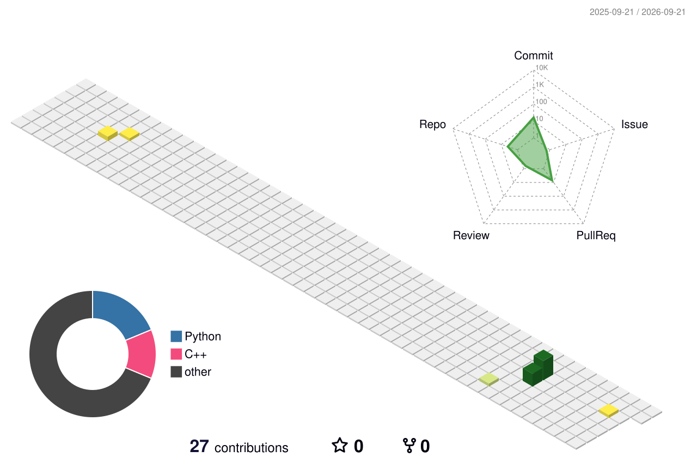

  

---

## 👋 关于我

你好，我是 **ping**，目前就读于电子科技大学，研究生阶段主要关注 **Java 后端开发、分布式系统、AI Agent 与语音智能**。

- 🎓 电子科技大学计算机技术专业硕士研究生，推荐免试
- 💻 具备美团核心本地商业后端开发实习经历
- ☕ 主要技术方向为 Java、Spring Boot、MySQL、Redis 与消息队列
- 🚀 关注高并发服务、缓存体系、分布式架构和系统稳定性
- 🤖 正在学习 AI Agent、LLM 应用开发与语音识别相关技术
- 📝 喜欢通过项目实践和技术笔记持续沉淀所学内容

## 🧰 技术栈

### Backend

- **Java**：集合框架、并发编程、JVM 基础与面向对象设计
- **Spring**：Spring、Spring Boot、Spring MVC、MyBatis
- **Database**：MySQL、PostgreSQL、SQL 优化与事务机制
- **Cache**：Redis、Caffeine、多级缓存及常见缓存问题治理
- **Message Queue**：Kafka、RocketMQ 与异步消息处理

### Engineering

- Linux、Git、Maven、Docker、Nginx
- RESTful API、日志排查、接口调试与性能分析
- 熟悉常见设计模式、分层架构和基础分布式系统思想

### Exploring

- AI Agent 与 LLM 应用开发
- Whisper 语音识别与模型蒸馏
- FastAPI、PyTorch 与 AI 工程化实践

---

## 🚀 项目与实践

| Repository | Description |
| :-- | :-- |
| [modern-software-dev-assignments](https://github.com/870255728/modern-software-dev-assignments) | 现代软件开发课程实践，包含 Prompt Engineering 与 Agentic Development 等内容 |
| [bptree](https://github.com/870255728/bptree) | 数据结构与 B+Tree 相关学习实践 |
| [echo_server_code](https://github.com/870255728/echo_server_code) | 网络编程与服务端开发相关实践 |

更多内容可以在我的 [GitHub Repositories](https://github.com/870255728?tab=repositories) 中查看。

---

  <picture>
    <source media="(prefers-color-scheme: dark)" srcset="https://raw.githubusercontent.com/870255728/870255728/output/github-contribution-grid-snake-dark.svg">
    <source media="(prefers-color-scheme: light)" srcset="https://raw.githubusercontent.com/870255728/870255728/output/github-contribution-grid-snake.svg">
    
  </picture>

---

  

---

## 📫 联系我

- GitHub：[github.com/870255728](https://github.com/870255728)
- Email：[870255728@qq.com](mailto:870255728@qq.com)

> 保持好奇，持续学习，用工程实践沉淀真正的能力。

